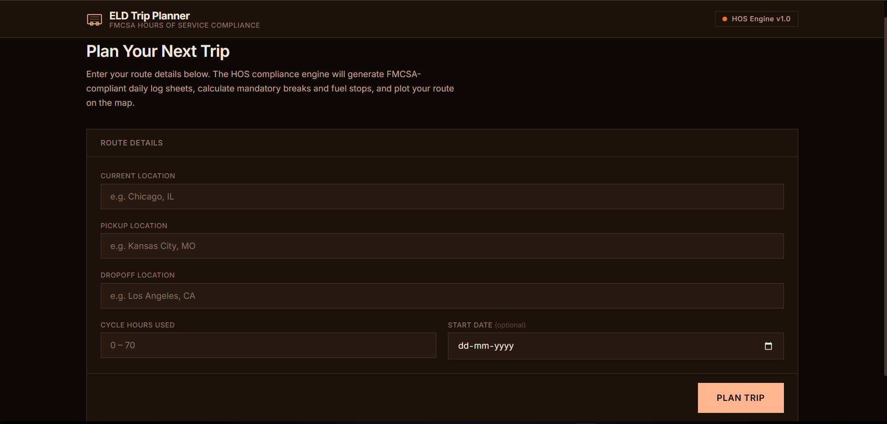
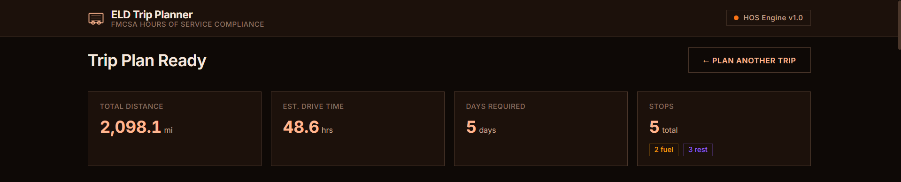
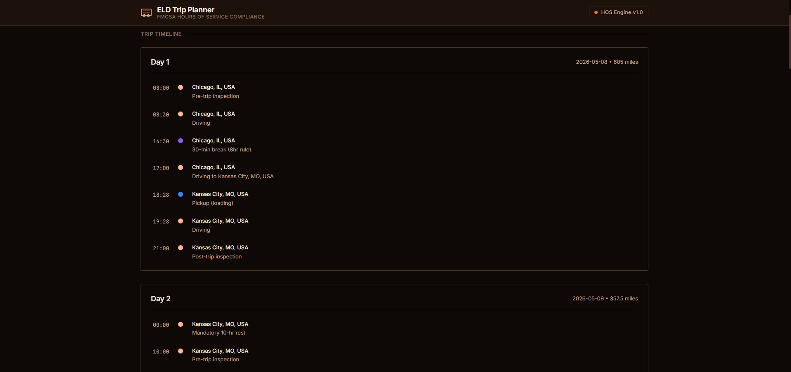
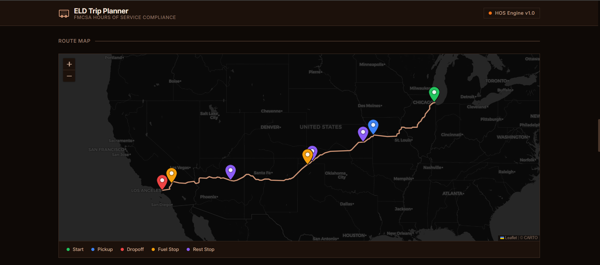
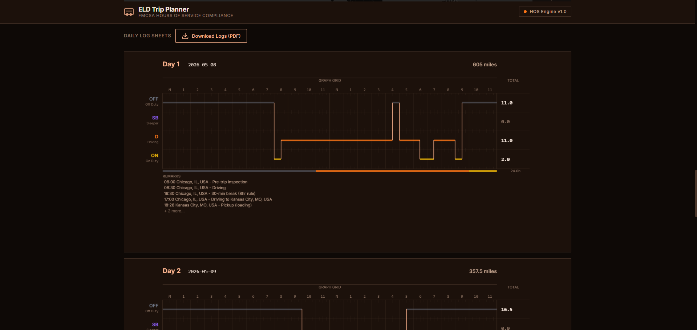
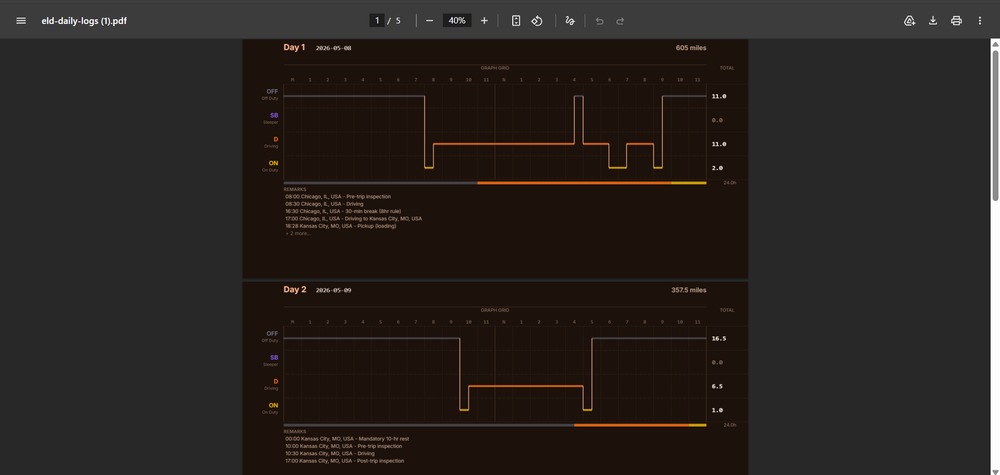

# 🚛 ELD Trip Planner

**Full-Stack FMCSA Hours-of-Service Compliance Engine**

A production-grade web application that generates FMCSA-compliant **Daily Driver's Log Sheets** for property-carrying commercial motor vehicles. Enter your route — the engine simulates the entire journey and outputs legally compliant logs, an interactive route map, and a downloadable PDF.

> Built with **Django REST Framework** (backend) + **React 19 / Vite** (frontend)

---

## 📋 Table of Contents

- [Features](#-features)
- [Architecture](#-architecture)
- [Tech Stack](#-tech-stack)
- [Project Structure](#-project-structure)
- [Getting Started](#-getting-started)
  - [Prerequisites](#prerequisites)
  - [Backend Setup](#1-backend-setup)
  - [Frontend Setup](#2-frontend-setup)
  - [OpenRouteService API Key](#3-openrouteservice-api-key)
- [Usage Guide](#-usage-guide)
- [API Reference](#-api-reference)
- [FMCSA HOS Rules Implemented](#-fmcsa-hos-rules-implemented)
- [Testing](#-testing)
- [Deployment](#-deployment)
- [Screenshots](#-screenshots)

---

## ✨ Features

| Feature | Description |
|---------|-------------|
| **HOS Compliance Engine** | Algorithmically enforces all FMCSA property-carrying HOS regulations |
| **Canvas Log Sheets** | High-performance HTML5 `<canvas>` rendering of the official FMCSA 24-hour grid |
| **Interactive Route Map** | Leaflet dark-mode map with route polyline and color-coded stop markers |
| **Trip Timeline** | Vertical day-by-day timeline of all duty status changes |
| **PDF Export** | One-click download of all daily logs as a multi-page landscape PDF |
| **Stat Dashboard** | Summary cards showing total distance, drive time, days required, and stop breakdown |
| **Error Handling** | Graceful handling of geocoding failures, API key issues, and validation errors |
| **Dark Mode UI** | Premium dark-mode interface optimized for readability |

---

## 🏗 Architecture

```
┌─────────────────────────────────────────────────────────────────┐
│                        FRONTEND (React + Vite)                  │
│                                                                 │
│  TripForm → LoadingSpinner → TripSummary → TripTimeline         │
│                              → MapView   → LogSheet (Canvas)    │
│                              → ExportPdfButton                  │
└──────────────────────────────┬──────────────────────────────────┘
                               │ POST /api/trip/plan/
                               ▼
┌─────────────────────────────────────────────────────────────────┐
│                     BACKEND (Django REST Framework)             │
│                                                                 │
│  TripPlanView (views.py)                                        │
│    ├── TripPlanSerializer  →  Input Validation                  │
│    ├── geocoder.py         →  Geocode + Route (OpenRouteService)│
│    ├── hos_calculator.py   →  HOS Compliance Engine             │
│    └── Response            →  { route, daily_logs, stop_events }│
└─────────────────────────────────────────────────────────────────┘
```

### Data Flow

1. **User** fills in the trip form (current location, pickup, dropoff, cycle hours)
2. **Frontend** sends `POST /api/trip/plan/` to the Django backend
3. **Backend** geocodes locations → calculates driving routes → runs the HOS engine
4. **HOS Engine** simulates the trip minute-by-minute, enforcing all FMCSA rules
5. **Response** returns `route` (geometry + waypoints), `daily_logs`, and `stop_events`
6. **Frontend** renders stat cards, timeline, map with polyline/markers, and canvas log sheets
7. **User** can export all logs to PDF with one click

---

## 🧰 Tech Stack

### Backend
| Technology | Purpose |
|------------|---------|
| Python 3.10+ | Runtime |
| Django 5.x | Web framework |
| Django REST Framework | API serialization & views |
| OpenRouteService API | Geocoding + truck-optimized routing |
| python-decouple | Environment variable management |
| gunicorn | Production WSGI server |
| whitenoise | Static file serving |

### Frontend
| Technology | Purpose |
|------------|---------|
| React 19 | UI framework |
| Vite 8 | Build tool & dev server |
| Leaflet + react-leaflet | Interactive maps |
| jsPDF | PDF generation from canvas |
| Axios | HTTP client |

---

## 📁 Project Structure

```
full stack assessment/
├── README.md
├── MASTER_PROMPT_ELD_APP.md         # Original assessment requirements
│
├── backend/
│   ├── .env                         # Environment variables (not committed)
│   ├── .env.example                 # Template for env vars
│   ├── Procfile                     # Heroku/Render deployment
│   ├── requirements.txt             # Python dependencies
│   ├── manage.py
│   ├── config/
│   │   ├── settings.py              # Django settings (CORS, DRF, ORS key)
│   │   ├── urls.py                  # Root URL config
│   │   └── wsgi.py
│   └── trip/
│       ├── views.py                 # TripPlanView — orchestrates the pipeline
│       ├── serializers.py           # Input validation (locations, cycle hours)
│       ├── hos_calculator.py        # 🧠 Core HOS compliance engine (495 lines)
│       ├── geocoder.py              # ORS geocoding, routing, reverse geocoding
│       ├── urls.py                  # /api/trip/plan/ endpoint
│       └── tests/
│           ├── test_hos_calculator.py   # 57 HOS engine tests
│           └── test_views.py            # 13 API endpoint tests
│
└── frontend/
    ├── package.json
    ├── vite.config.js
    ├── vercel.json                  # Vercel SPA routing
    ├── index.html
    └── src/
        ├── main.jsx                 # React entry point
        ├── App.jsx                  # Root component — routing & state
        ├── App.css                  # Layout styles
        ├── index.css                # Design system tokens & base styles
        ├── api/
        │   ├── tripApi.js           # Axios client for /api/trip/plan/
        │   └── mockTripResult.js    # Mock data for offline development
        └── components/
            ├── TripForm.jsx         # Input form with validation
            ├── TripForm.css
            ├── TripSummary.jsx      # Stat cards (distance, time, days, stops)
            ├── TripSummary.css
            ├── TripTimeline.jsx     # Vertical event timeline
            ├── TripTimeline.css
            ├── MapView.jsx          # Leaflet map with markers & polyline
            ├── MapView.css
            ├── LogSheet.jsx         # 🎨 Canvas-rendered FMCSA daily log (442 lines)
            ├── LogSheet.css
            ├── ExportPdfButton.jsx  # PDF export from canvas elements
            ├── ExportPdfButton.css
            ├── ErrorBanner.jsx      # Dismissable error display
            ├── LoadingSpinner.jsx   # Animated loading state
            └── LoadingSpinner.css
```

---

## 🚀 Getting Started

### Prerequisites

- **Python** 3.10 or higher
- **Node.js** 18 or higher (with npm)
- **OpenRouteService API Key** (free — [sign up here](https://openrouteservice.org/dev/#/signup))

### 1. Backend Setup

```bash
# Clone the repository
git clone <your-repo-url>
cd "full stack assessment/backend"

# Create and activate a virtual environment
python -m venv venv

# Windows
venv\Scripts\activate

# macOS/Linux
source venv/bin/activate

# Install Python dependencies
pip install -r requirements.txt

# Copy environment template and configure
cp .env.example .env
# Edit .env and add your ORS_API_KEY (see step 3)

# Run database migrations
python manage.py migrate

# Start the development server
python manage.py runserver
```

The backend API will be available at **`http://localhost:8000`**

### 2. Frontend Setup

```bash
# In a new terminal
cd "full stack assessment/frontend"

# Install Node dependencies
npm install

# Start the development server
npm run dev
```

The frontend will be available at **`http://localhost:5173`**

### 3. OpenRouteService API Key

The application uses [OpenRouteService](https://openrouteservice.org) for geocoding city names to coordinates and calculating truck-optimized driving routes.

1. Go to [openrouteservice.org/dev/#/signup](https://openrouteservice.org/dev/#/signup)
2. Create a free account
3. Generate an API token from the dashboard
4. Add it to `backend/.env`:

```env
ORS_API_KEY=your_actual_api_key_here
```

> **Note:** The free tier allows 2,000 requests/day which is more than sufficient for development and testing.

---

## 📖 Usage Guide

### Step 1: Enter Trip Details

Fill in the form with your trip parameters:

| Field | Description | Example |
|-------|-------------|---------|
| **Current Location** | Where the driver currently is | `Chicago, IL` |
| **Pickup Location** | Where the load is picked up | `Kansas City, MO` |
| **Dropoff Location** | Where the load is delivered | `Los Angeles, CA` |
| **Cycle Hours Used** | Hours already used in the 70-hour/8-day window (0–70) | `20` |
| **Start Date** | *(optional)* Trip start date | Defaults to today |

### Step 2: Review Results

After clicking **"Plan Trip"**, the application generates:

1. **📊 Trip Summary** — Four stat cards showing total distance, estimated drive time, days required, and total stops (broken down by fuel vs. rest)

2. **📅 Trip Timeline** — A vertical, chronological timeline of every duty status change, organized by day. Events are color-coded:
   - 🟠 Amber = Inspections & driving
   - 🟣 Purple = Rest breaks
   - 🔵 Blue = Pickup
   - 🔴 Red = Dropoff

3. **🗺️ Route Map** — An interactive Leaflet map with:
   - The full route polyline (Current → Pickup → Dropoff)
   - Color-coded markers for each stop type
   - Click any marker to see its name and mile marker
   - Auto-zoom to fit the entire route

4. **📝 Daily Log Sheets** — FMCSA-compliant log grids rendered on HTML5 Canvas:
   - 24-hour time grid (Midnight → Midnight)
   - Four status rows: Off Duty, Sleeper Berth, Driving, On Duty
   - Color-coded status bars with vertical transition lines
   - Header with day number, date, and total miles
   - Totals column (each day sums to exactly 24.0 hours)
   - Remarks section listing each location and activity

### Step 3: Export to PDF

Click the **"Download Logs (PDF)"** button above the log sheets. This generates a multi-page landscape PDF containing all daily log sheets — ready for printing or submission.

### Step 4: Plan Another Trip

Click **"← Plan Another Trip"** to reset the form and start over.

---

## 📡 API Reference

### `POST /api/trip/plan/`

Plans a complete HOS-compliant trip with daily log generation.

#### Request Body

```json
{
  "current_location": "Chicago, IL",
  "pickup_location": "Kansas City, MO",
  "dropoff_location": "Los Angeles, CA",
  "current_cycle_used": 20,
  "start_date": "2026-05-07"
}
```

| Field | Type | Required | Constraints |
|-------|------|----------|-------------|
| `current_location` | string | ✅ | Max 200 chars |
| `pickup_location` | string | ✅ | Max 200 chars |
| `dropoff_location` | string | ✅ | Max 200 chars |
| `current_cycle_used` | float | ✅ | 0–70 |
| `start_date` | string | ❌ | `YYYY-MM-DD`, defaults to today |

#### Success Response (200)

```json
{
  "route": {
    "total_distance_miles": 2110.5,
    "total_duration_hours": 38.4,
    "geometry": {
      "type": "LineString",
      "coordinates": [[-87.63, 41.88], ...]
    },
    "waypoints": [
      {
        "type": "start",
        "name": "Chicago, IL, USA",
        "lat": 41.8781,
        "lon": -87.6298,
        "miles_from_start": 0
      }
    ]
  },
  "daily_logs": [
    {
      "day": 1,
      "date": "2026-05-07",
      "miles_today": 550,
      "totals": {
        "off_duty": 13.27,
        "sleeper_berth": 0,
        "driving": 9.5,
        "on_duty_not_driving": 1.23
      },
      "events": [
        {
          "time": "08:00",
          "status": "on_duty_not_driving",
          "location": "Chicago, IL",
          "hours": 0.5,
          "miles": 0
        }
      ],
      "remarks": [
        "08:00 Chicago, IL - Pre-trip inspection",
        "08:30 Chicago, IL - Driving to Kansas City"
      ]
    }
  ],
  "stop_events": [
    {
      "type": "fuel",
      "location_name": "Springfield, MO",
      "total_miles_at_stop": 1000
    }
  ]
}
```

#### Error Responses

| Status | Cause | Response |
|--------|-------|----------|
| 400 | Validation failed | `{"error": "Validation failed", "details": {...}}` |
| 400 | Location not found | `{"error": "Could not find location: 'xyz'"}` |
| 400 | API key missing/invalid | `{"error": "ORS_API_KEY is not configured..."}` |
| 500 | Unexpected server error | `{"error": "An unexpected error occurred..."}` |

---

## ⚖️ FMCSA HOS Rules Implemented

This engine implements the **FMCSA Hours of Service regulations for property-carrying CMV drivers** (49 CFR Part 395):

| Rule | Limit | Implementation |
|------|-------|----------------|
| **11-Hour Driving Limit** | Max 11 hours driving after 10 consecutive hours off duty | Forces 10-hour mandatory rest, starts new shift day |
| **14-Hour Driving Window** | Cannot drive after 14th hour since coming on duty | Window tracked from first on-duty event each shift |
| **30-Minute Break** | Required after 8 cumulative hours of driving | Inserted as off-duty break; reset by any ≥30-min off-duty period |
| **70-Hour/8-Day Limit** | Max 70 hours on-duty in any 8 consecutive days | Tracked via `current_cycle_used` input; triggers 34-hour restart |
| **34-Hour Restart** | Resets the 70-hour clock | Split across calendar days if needed; logged as off-duty |
| **10-Hour Off-Duty** | Required between shifts | Forced when any driving limit is reached |

### Fixed Assumptions

| Parameter | Value |
|-----------|-------|
| Driver speed | 55 mph average |
| Fuel stop interval | Every 1,000 miles |
| Fuel stop duration | 1 hour (On Duty Not Driving) |
| Pickup duration | 1 hour (On Duty Not Driving) |
| Dropoff duration | 1 hour (On Duty Not Driving) |
| Pre-trip inspection | 30 minutes (On Duty Not Driving) |
| Post-trip inspection | 30 minutes (On Duty Not Driving) |
| Day 1 start time | 08:00 |

---

## 🧪 Testing

The project includes a comprehensive test suite covering the HOS engine, API validation, serializer rules, and end-to-end behavior.

### Run All Backend Tests (with coverage)

```bash
cd backend
# Install deps from lockfile
pip install -r requirements.lock

# Run tests with coverage (mirrors CI exactly)
coverage run --source=trip manage.py test
coverage report --fail-under=70
```

### Run Frontend Tests (with coverage)

```bash
cd frontend
npm ci
npm run test:coverage   # enforces 80% statements/lines, 65% branches, 75% functions
```

### Test Categories

| Category | File | What's Tested |
|----------|------|---------------|
| **HOS Short Trip** | `test_hos_calculator_single_day.py` | 200mi single-day, inspections, pickup/dropoff |
| **HOS Multi-day** | `test_hos_calculator_multiday.py` | 600–2110mi, breaks, fuel stops, rest stops |
| **HOS Edge Cases** | `test_hos_calculator_edge_cases.py` | Cycle limits, 34hr restart, zero-distance, 70h boundary |
| **Serializer** | `test_serializers.py` | RegexValidator, cycle bounds, cross-field pickup≠dropoff |
| **API Views** | `test_views.py` | Validation, success flow, error handling, health/metrics/version |
| **Frontend** | `src/components/__tests__/` | ErrorBanner, LoadingSpinner, LogSheet, MapView, TripForm, TripSummary, TripTimeline (7 files, 55 tests) |

### Key Invariant

> **Every daily log's totals (off_duty + sleeper_berth + driving + on_duty_not_driving) must equal exactly 24.0 hours.**
>
> This invariant is enforced by an `assert` in the HOS engine and verified by 12+ dedicated tests across all trip scenarios.

---

## 🚢 Deployment

### Backend (Render / Railway / Heroku)

The backend is deploy-ready with:
- `Procfile` — `web: gunicorn config.wsgi`
- `requirements.txt` — all Python dependencies
- `whitenoise` — serves static files without nginx
- Environment variables via `python-decouple`

**Required environment variables:**
```
SECRET_KEY=<random-production-key>
DEBUG=False
ALLOWED_HOSTS=your-domain.com
ORS_API_KEY=<your-ors-api-key>
CORS_ALLOWED_ORIGINS=https://your-frontend-domain.com
```

### Frontend (Vercel)

The frontend includes a `vercel.json` for SPA fallback routing:

```json
{
  "rewrites": [{ "source": "/(.*)", "destination": "/index.html" }]
}
```

**Required environment variables:**
```
VITE_API_URL=https://your-backend-domain.com/api
```

---

## 📸 Screenshots

### Trip Input Form
The form accepts current location, pickup/dropoff addresses, and current cycle hours.


### Trip Summary Dashboard
Four stat cards display total distance, estimated drive time, days required, and stop count.


### Trip Timeline
A vertical chronological timeline with color-coded event dots showing every duty status change.


### Interactive Route Map
CARTO Dark Matter tiles with a route polyline and custom SVG markers for each stop type.


### Daily Log Sheets
Canvas-rendered FMCSA-compliant 24-hour grids with color-coded status bars, transition lines, and remarks.


### PDF Export
All daily log sheets exported as a multi-page landscape PDF.

---

*Built with ❤️ using Django REST Framework, React 19, Leaflet, and a lot of HOS math.*
